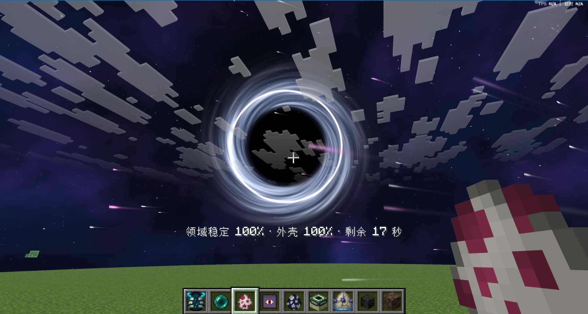
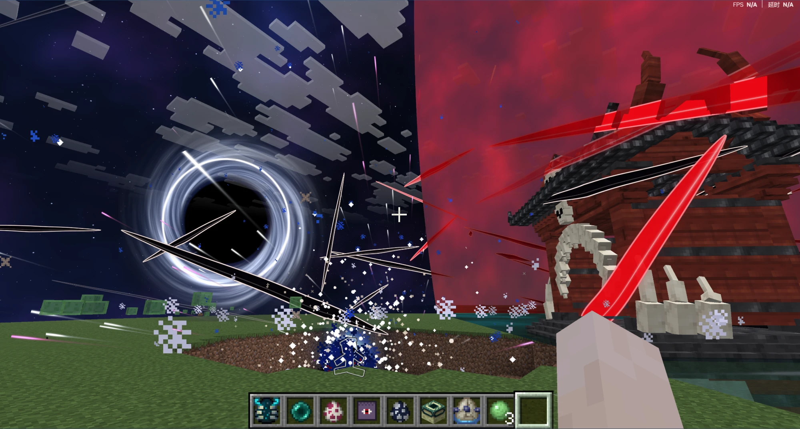
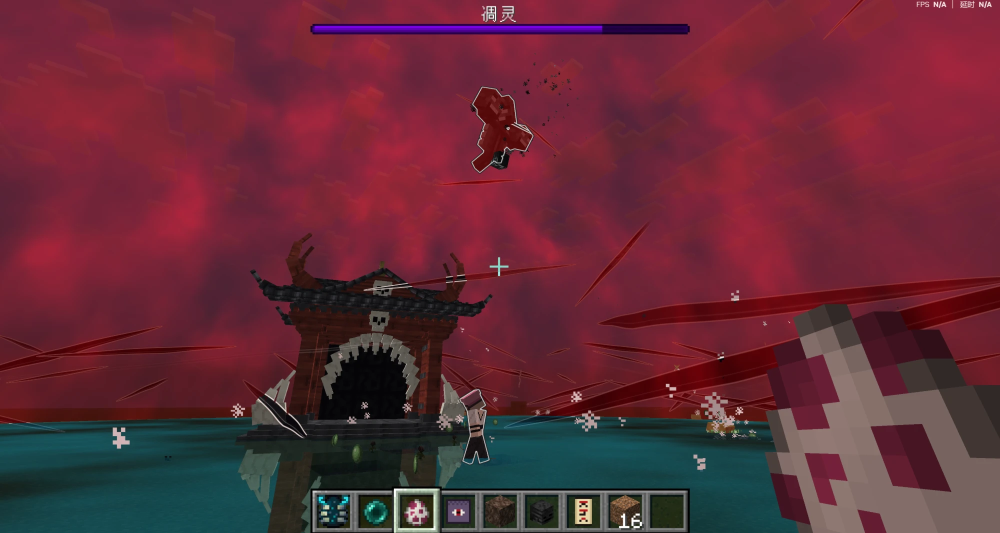
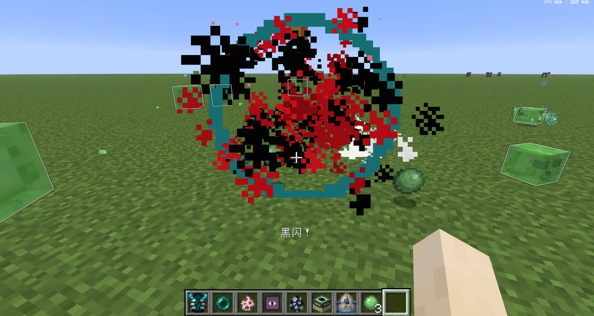
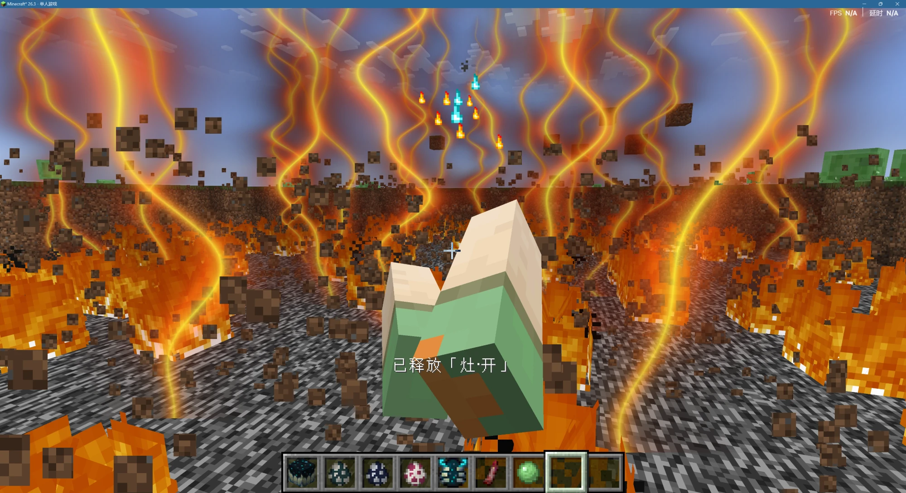
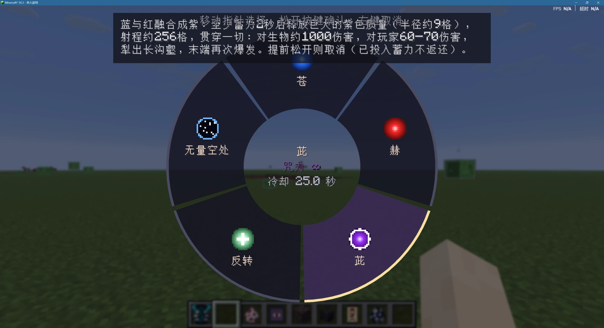

# Minecraft 咒术回战 · 五条悟 × 宿傩 · JJK Gojo × Sukuna

[](https://www.minecraft.net/)
[](https://fabricmc.net/)
[](https://adoptium.net/)
[](LICENSE)
[](https://github.com/RoyceBella-commits/Minecraft-26.3-JJK-Gojo-Sukuna-mod/releases/latest)

一个只做两个人的咒术回战 Fabric Mod：**五条悟**和**两面宿傩**。现在大火的一些咒术回战 Mod 内容很全，但部分设计有些过于复杂；这个 Mod 把重心放在两人的术式、领域和彼此之间的对抗上，单机可以爽玩，联机可以打一场宿傩对五条悟。

> *English:* A focused Jujutsu Kaisen Fabric mod with two playable paths — Satoru Gojo and Ryomen Sukuna — featuring their signature techniques, domain expansions and domain clashes, Mahoraga's adaptation, a five-stage progression, full-power NPCs, and Gojo-vs-Sukuna multiplayer duels.



---

## 🖼️ 画面一览

| | |
|---|---|
|  **领域对抗**：两个领域以分界面各占一侧，斩击穿过交界 |  **伏魔御厨子**：血红天空、镜面地面、必中斩击 |
|  **黑闪**：空手满蓄力一拳，概率打出 3 倍伤害 |  **灶·开**：火焰箭引发大范围爆燃 |
|  **技能轮盘**：按住左 Alt 选择术式 | |

## 📥 安装

需要：

| 组件 | 版本 |
|---|---|
| Minecraft Java 版 | 26.3 |
| [Fabric Loader](https://fabricmc.net/use/installer/) | 0.19.5 或更高 |
| [Fabric API](https://modrinth.com/mod/fabric-api) | 0.161.0+26.3 |
| Java | 25（官方启动器会自动提供） |

步骤：

1. 用 [Fabric 安装器](https://fabricmc.net/use/installer/)为 Minecraft 26.3 安装 Fabric Loader。
2. 从 [Releases](https://github.com/RoyceBella-commits/Minecraft-26.3-JJK-Gojo-Sukuna-mod/releases/latest) 下载 `jjk-gojo-sukuna-2.2.6+mc26.3.jar`。
3. 把它和 Fabric API 一起放进游戏目录的 `mods` 文件夹（Windows 默认是 `%APPDATA%\.minecraft\mods`）。
4. 在启动器里选择 Fabric 配置启动游戏。

**单人游戏**：装在自己电脑上即可。
**多人服务器**：服务端和所有客户端都要装同一版本。
**从旧版本升级**：先删掉旧 JAR（Mod ID 相同，同时放两个会报错），旧存档可以继续用。

技能会破坏地形，第一次试玩建议新建超平坦世界；在正式存档里玩之前先备份，或用 `/jjk terrain off` 关掉地形破坏。

## 🎮 玩法

### 选择路线

第一次使用「**六眼修习凭证**」成为五条悟，第一次吃下「**宿傩的手指**」成为宿傩。**路线锁定后不能更改**，另一条路线的道具对你无效。

之后按住 **左 Alt** 打开技能轮盘选择术式，按 **G** 施放：短按直接放，按住蓄力或持续，松开释放。也可以在按键设置里给每个技能单独绑定快捷键；快捷键施放不会改变轮盘里选中的技能。

### 咒力、冷却与术式熔断

- 每个技能都消耗咒力（上限 1000），蓄力越久消耗越多，咒力会随时间自动恢复。**Ⅴ 阶段咒力无限**，但冷却和熔断照旧。
- 每个技能有独立冷却，见下方技能表。
- **术式熔断**：领域结束后进入 8 秒熔断。熔断期间苍、赫、茈、解、捌、灶·开、世界斩、领域、魔虚罗都不能用，**无下限失效**，空间瞬移不可用；反转术式和咒力连打仍可使用。熔断是对战里最关键的反击窗口。

### 成长

觉醒后是 Ⅰ 阶段。每一阶都要先完成练习（命中训练靶或敌人都算），练习完成会有提示，再用一份本路线道具升阶，共五阶。

| 升阶 | 练习要求 |
|---|---|
| Ⅰ → Ⅱ | 有效命中 5 次 |
| Ⅱ → Ⅲ | 有效命中 15 次，并使用过两种主动技能 |
| Ⅲ → Ⅳ | 有效命中 25 次，并成功施放一次重型攻击（茈、灶·开或世界斩） |
| Ⅳ → Ⅴ | 成功展开一次领域后，再有效命中 5 次 |

每阶的属性：

| 阶段 | 金心 | 护甲 | 徒手伤害 | 黑闪概率 | 其他伤害承受 | 被咒术 / Fate 角色打时承受 |
|---|---|---|---|---|---|---|
| 未觉醒 | – | – | 1 | – | 100% | 100% |
| Ⅰ | 10 颗 | 10 | 8 | 4% | 80% | 82% |
| Ⅱ | 15 颗 | 12 | 11 | 8% | 60% | 64% |
| Ⅲ | 20 颗 | 14 | 14 | 12% | 41% | 46% |
| Ⅳ | 25 颗 | 16 | 17 | 16% | 21% | 28% |
| Ⅴ | 30 颗 | 20 | 20 | 20% | 1% | 10% |

- **金心**：额外的一层生命，受伤时先扣金心再扣红心。
- **徒手伤害**：只在空手时生效，手里拿着东西没有加成。
- **黑闪**：空手满蓄力的一拳按概率触发，伤害 ×3（Ⅴ 阶段约 60），带红黑闪电和专属音效。
- **承伤**：按“例外”规则结算——原版生物、环境和**任何第三方 Mod 的生物**一律按「其他伤害」计算（Ⅴ 阶段最多承受 1%），只有五条悟 / 宿傩一方（路线玩家、NPC、魔虚罗）和 「Fate 英雄王与骑士王」Mod 的角色例外（Ⅴ 阶段 10%）。`/kill` 和虚空不受影响。
- **反转术式**：Ⅱ 阶段起被动缓慢回血（先红心后金心）；主动使用时快速大量回血，治疗时移动变慢。

面板（J）上会显示当前阶段、练习进度和以上属性。

### 五条悟

| 阶段 | 技能 | 冷却 | 说明 |
|---|---|---|---|
| Ⅰ | 六眼（被动） | – | 32 格内视线可见的敌人显示发光轮廓，黑暗和洞穴里也能看清；被墙挡住的不显示 |
| Ⅰ | 无下限·无限（B 切换） | – | 挡住攻击、箭矢和环境伤害（摔落、岩浆、火焰、爆炸、仙人掌等）；箭矢和投掷物会停在身前约 2 秒后掉落。开启时持续消耗咒力，咒力不足会自动关闭 |
| Ⅰ | 空间瞬移（C） | 无 | 瞬移到准星指着的位置，最远 50 格；指向墙时落在墙前；不能穿过封闭领域的边界 |
| Ⅰ | 术式顺转·苍 | 3 秒 | 短按：在准星处制造吸引点，拉拢并碾压敌人，结束时坍缩爆炸。按住：苍在身边约 5 格处环绕旋转（没有苍时按住约 0.4 秒直接在身边生成，按得越久越大），松开后停在原处 |
| Ⅱ | 术式反转·赫 | 6 秒 | 射出红色排斥冲击，命中后大范围爆炸并远远击飞；蓄力提高威力和范围。和苍配合「先聚拢、再轰飞」；**赫击中自己的苍会合成小一号的茈**：伤害和范围减半（对生物约 500、对玩家 30–35，受护甲影响），射程约 128 格，但能**秒杀魔虚罗** |
| Ⅱ | 反转术式 | 8 秒 | 按住快速治疗；治疗时无限可以保持开启 |
| Ⅱ | 凌空踏步（Z） | – | 空中踏步 |
| Ⅲ | 虚式·茈 | 25 秒 | 至少蓄力 2 秒，蓝红两球螺旋汇合成紫；释放后射程约 256 格，贯穿一切，沿途犁出沟壑，末端再次爆发。对生物约 1000 伤害，对玩家 60–70。提前松开则取消，已投入的咒力不返还 |
| Ⅳ | 领域展开·无量空处 | 60 秒 | 见下方「领域展开」 |

### 两面宿傩

| 阶段 | 技能 | 冷却 | 说明 |
|---|---|---|---|
| Ⅰ | 解 | 0.4 秒 | 远程切面；蓄力 1.5 秒后变成向前推进的网格斩，切开沿途地形 |
| Ⅰ | 咒力远跳（C） | 无 | 温斯顿式跃击：不按键或按 W 沿视线高抛，抬头越高跳得越高、越近；按 S / A / D 朝该方向贴地跳；滞空时下落变慢，落地重击只有特效，不伤人、不毁地形；每次离地只能在空中再跳一次 |
| Ⅱ | 捌 | 3 秒 | 锁定准星 100 格内的生物连续斩击；蓄力提高斩击大小和次数，最多 20 次 |
| Ⅱ | 咒力连打 | 10 秒 | 双手凝聚咒力，松开后左右交替打出五拳，每拳对三格内的敌人造成连续伤害 |
| Ⅱ | 反转术式（按住 B） | 8 秒 | 快速治疗 |
| Ⅱ | 咒力跃升（Z） | – | 只能从地面发动 |
| Ⅲ | 灶·开 | 6 秒 | 拉开燃烧的弓，松开发射火焰箭，命中引发大范围爆燃 |
| Ⅲ | 世界斩 | 15 秒 | 蓄力后放出一道切开空间的斩击，**任何时候都能直接突破无下限**。对生物约 1000 伤害，对玩家 60–70 |
| Ⅳ | 领域展开·伏魔御厨子 | 60 秒 | 见下方「领域展开」 |
| Ⅳ | 十种影法术·魔虚罗 | 30 秒 | 见下方「魔虚罗」 |

### 魔虚罗

宿傩 Ⅳ 阶段解锁的式神，从你脚下的影子里现身。每人同时只能有一个，再次召唤会替换旧的。

**基础属性**：900 血、8 护甲、近战伤害 28、60% 击退抗性。

**战斗方式**：
- 近战是四段循环的斩击，其中有扫向正前方和环绕一圈的范围斩，斩击会切开地形；
- 目标在高处或路被挡住时会跳起来（最高约 12 格），落地冲击对 5 格内的敌人造成 24 伤害并把人掀起。

**攻击谁**：
- 打你的人、打它的人；
- 24 格内最近的敌对怪物（宿傩 NPC 除外）；
- 不会攻击你，也不会被你误伤。
- 它不会主动去找其他玩家，但只要对方打了你或它，就会追上去。

**跟随、收回与再召唤**：
- 离你超过 24 格（战斗中超过 48 格）会穿过影子瞬移回你身边；
- 已召唤时，在轮盘选中魔虚罗再按施放键可以**收回**，提示“已收回”。下次召唤时**血量和已完成的适应都会保留**；
- 魔虚罗死亡后再召唤就是全新的，而且**阵亡后 5 分钟内无法再次召唤**（平时冷却 30 秒），这个冷却在你死亡或重新登录后仍然保留；
- **宿傩的法轮**：魔虚罗在场时，你头顶也会出现一个同样的法轮。它和魔虚罗的法轮一样适应伤害：受到某类伤害后开始解析，每 3 秒转动一格（每格减免该类伤害 20%），15 秒后对该类伤害完全免疫。只适应伤害，不会获得魔虚罗的进化能力。魔虚罗被收回或阵亡时，法轮和它学到的适应一起消散。

**适应（法轮）**：
- 第一次受到某种伤害时提示“法轮开始解析”。之后**每 3 秒完成一个适应阶段**，法轮转动一格并响一声；
- 每完成一阶，这种伤害减少 20%，**5 阶（15 秒）后完全免疫**；
- 伤害按类型区分，例如玩家近战、生物近战、箭矢、三叉戟、爆炸、火焰、岩浆、摔落、溺水、冻结、凋零、魔法等。五条悟的苍、赫、茈和宿傩的大部分术式都属于「魔法」一类，世界斩和领域必中各算单独一类；
- 有害状态效果（中毒、失明、饥饿等）和蜘蛛网只需 3 秒就能适应并免疫；
- 每完全适应一种伤害：攻击 +2，每秒额外回复 1 点血。

**进化**：完全适应某一类之后再过 3 秒，还会获得对应的进化能力：

| 适应的伤害 | 进化 | 效果 |
|---|---|---|
| 近战、爆炸 | 不屈之躯 | 最大生命 +20；血量低于 30% 时立即回复 8 点并获得 3 秒无敌（每 60 秒一次） |
| 火焰、灼热地面 | 御火之躯 | 不再着火，在岩浆里游得更快 |
| 岩浆 | 熔岩行者 | 不再着火，可以站在岩浆上行走 |
| 溺水 | 深海适应 | 水下呼吸，可以在水面行走 |
| 冻结 | 霜寒之躯 | 不再冻结，可以在细雪上行走 |
| 摔落、撞墙 | 翼化生存 | 目标在高处时直接飞扑过去 |
| 箭矢、三叉戟等投射物 | 弹道适应 | 已免疫的投射物飞到身边会被反弹回去 |
| 魔法、凋零 | 再生进化 | 血量低于一半时回血速度 ×1.5 |
| 虚空 | 虚空归还 | 掉进虚空会被传回最近的安全落点 |
| 灵魂沙 | 灵魂地面适应 | 在灵魂沙上不再减速 |

**对无下限**：魔虚罗的攻击被无限挡住时法轮会转动，提示“正在适应「无限」x/3”；第 3 次就能突破，**5 秒内可以打中五条悟**，之后重新计数，可以反复突破。

创造物品栏里还有单独的**魔虚罗刷怪蛋**，刷出的魔虚罗没有主人，会攻击附近的敌对怪物和攻击它的人。

### 无下限与破解

无下限开启时，普通怪物、未觉醒玩家、五条悟一方的攻击、另一个五条悟领域的必中都会被挡住。**只有宿傩一方（宿傩路线玩家、宿傩 NPC、魔虚罗）能突破**：

- **世界斩**：任何时候都直接穿透；
- **同类命中 3 次**：攻击分为斩击（解、捌、伏魔御厨子的必中）、火焰（灶·开）、徒手（拳头、黑闪、咒力连打）三类。同一类连续命中 3 次（每次间隔不超过 10 秒），第 3 次打中，并破解这一类无下限 **5 秒**；5 秒后重新计数；
- **魔虚罗**：同理，被挡 3 次后 5 秒内可以打中。

破解时双方都会看到提示，例如“无下限被「斩击」突破（5 秒）”。另外，领域结束后的熔断期间无下限会直接失效。

### 领域展开

两个领域半径相同，都是 64 格；Ⅳ 阶段持续 20 秒，Ⅴ 阶段 30 秒；结束后进入 8 秒术式熔断。

**无量空处（五条悟）**
- 结印至少 1 秒后，黑色球体从脚下向外铺展。这是**封闭领域**：外面看是黑球；走进去的一瞬间白光一闪，**脚下的地面消失**，四周和脚下都是深蓝星空、星云和横贯天际的银河，身后的天空有巨大黑洞，像置身宇宙之中（只有人物、生物和术式还看得见）；瞬移不能穿过边界；
- 领域内所有敌人（怪物、首领、宿傩 NPC、敌对玩家、别人的魔虚罗）被**完全定身**：不能移动、不能施法、不能近战，每秒受到少量必中伤害；
- 队友、宠物、村民、动物不受影响；
- 施法者会看到“领域稳定 x% · 外壳 x% · 剩余 x 秒”。

**伏魔御厨子（宿傩）**
- **开放领域**：神龛出现在施法者身后约 12 格，天空变成翻涌的血红云层，地面变成倒映红云和神龛的青色镜面水面，远处水天交界处是一圈红雾；从领域外面看是一个血红色的球体；
- 范围内的敌人持续受到必中斩击，斩击会破坏地形；
- 必中斩击算作「斩击」类，可以用来破解无下限；
- 再次选中领域按施放键可以提前解除。

**领域对抗**
- 两个领域重叠时，画面以分界面切开，一侧是御厨子的红天和镜面地面，另一侧是星空和黑洞，交界处不断出现斩击和火花；从外面看是一半血红球体、一半黑色球体；交界处有一道发光的分界线（御厨子一侧赤红、无量空处一侧蓝白），无量空处一侧脚下也是星空；
- 两个领域一旦重叠即进入**领域对决**，势均力敌：双方剩余时间都最多保留 20 秒（本来就不足 20 秒的按原计时），**先展开的一方再多存在 2 秒**；
- 对决期间，两位施法者本人不受对方领域的任何效果（不被定身，也不挨必中斩击）；
- 夹在两个领域之间的其他生物会**同时承受两种领域效果**：既被定身，又被必中斩击打中；
- 宿傩被无量空处定身时，唯一能做的就是尝试展开伏魔御厨子（仍受领域冷却限制）；
- 领域期间，施法者本人受到的实际伤害累计达到「最大生命 + 金心上限」的一半时，领域动摇并崩解。

### 联机对抗

**准备**
- 服务端和所有客户端装同一版本；
- 服务器需要开启 PvP。同一队伍的队友、自己的宠物不会被技能和领域伤到，可以用原版 `/team` 分队打团战；
- 建议双方都升到 Ⅴ 阶段再打：Ⅴ 阶段其他伤害只承受 1%，但被五条悟 / 宿傩一方（或 Fate Mod 的王）打时承受 10%，所以对决主要靠术式和徒手互拼；
- 在正式存档里对战前，建议先用 `/jjk terrain off` 关掉地形破坏。

**伤害参考（打玩家）**
- 茈、世界斩：60–70，再按对方的承伤比例折算。茈和世界斩正面相撞会互相抵消，对方放出其中之一时你会收到「⚠ 对方释放了……」的提示；
- Ⅴ 阶段黑闪：约 60。

**五条悟的思路**
- 无下限常开，宿傩的斩击、火焰、徒手每一类都要连中 3 次才能打进来。注意它的计数，被破解后的 5 秒要拉开距离；
- 用苍把人拉到一起，接赫轰飞；把苍留在原地、朝它射赫可以合成茈，是对付魔虚罗的杀手锏；远距离用茈，对方放世界斩时可以用茈对撞抵消；
- 宿傩没开领域时，展开无量空处可以把他完全定身；
- 空间瞬移没有冷却，可以用来追击和躲世界斩。

**宿傩的思路**
- 世界斩是唯一能随时穿透无下限的手段，冷却 15 秒，要找准时机；
- 解的冷却只有 0.4 秒，适合快速叠「斩击」计数；
- 召唤魔虚罗一起压上：它被无限挡 3 次就能突破，还会慢慢适应五条悟的术式；魔虚罗在场时你自己头顶也有法轮，15 秒后同样能对五条悟的术式免疫。但魔虚罗一旦被合成茈秒杀，法轮立刻消散，5 分钟内无法再召唤；
- 对方展开无量空处时，冷却允许就立刻展开伏魔御厨子：进入领域对决后你不再被定身，双方领域最多再维持 20 秒；
- 被定身时除了展开领域什么都做不了；领域还在冷却就只能等队友或魔虚罗在领域外输出，打崩对方的领域。

**两边通用**
- 领域结束后的 8 秒熔断是最大的破绽：熔断中的五条悟没有无下限，熔断中的宿傩放不了斩击。尽量等对方先开领域；
- 反转术式在熔断中也能用，残血时先回血再说；
- 领域期间被打出足够伤害会让领域崩解，开领域后也别站着不动挨打。

**五条悟对五条悟**：双方的无下限互相挡住所有攻击，必中也会被挡，只能等对方关掉无限或进入熔断（Ⅴ 阶段咒力无限，无限不会因咒力耗尽而关闭）。想打得有来有回，建议宿傩对五条悟。

### 刷怪蛋 NPC

创造物品栏的「咒术回战」分页里有五条悟、宿傩、魔虚罗三种刷怪蛋。五条悟和宿傩 NPC 的属性按满级计算，会主动放技能和展开领域。NPC 有 **200 点生命**（与玩家区分开），受到的每次伤害按 2.5 倍结算，所以打倒它需要的攻击次数和以前一样：

- **五条悟 NPC**：攻击敌对生物、宿傩一方和魔虚罗；无下限常开，会用苍、赫（最常用）、瞬移、环绕的苍，偶尔用茈和无量空处；苦战（缠斗超过 8 秒或血量过半）或面对魔虚罗时，会放下苍、朝它射赫合成茈，再顺着茈的方向飞出去；
- **宿傩 NPC**：攻击除宿傩路线玩家以外的一切生物（包括其他玩家、村民、动物、五条悟 NPC）；会用解、捌、连打、灶·开、世界斩，偶尔展开伏魔御厨子；会积极召唤魔虚罗协同作战（面对强敌开战约 5 秒或血量低于 60% 时，面对任何对手缠斗 15 秒后），魔虚罗在场时它头顶同样有法轮；魔虚罗阵亡后 5 分钟内不再召唤；
- NPC 会拉开距离放远程技能；对强敌会用瞬移（五条悟）或大跳（宿傩）贴身打一套，再迅速拉开远程输出，依次往复；
- 缠斗超过 8 秒还没打赢时，NPC 会拉开距离，优先放茈（五条悟）或世界斩（宿傩）；看到对方放世界斩 / 茈时，会马上放茈 / 世界斩对撞抵消；
- 领域冷却 60 秒，冷却中绝不展开。冷却结束后，对方开领域或自己血量低于三分之一时会立即展开；
- 把两个 NPC 放在一起，就能直接看一场领域对抗。

### 管理员道具

以下道具仅限单人世界或管理员使用，没有合成配方，只能从创造物品栏或 `/give` 获得：

- **五条家秘传卷轴（直升）/ 宿傩手指匣（直升）**：右键无需练习直接升一阶（未觉醒则觉醒进对应路线），潜行右键直升 Ⅴ 阶段；不消耗，路线不符或已满级时不生效；
- **狱门疆**秒杀五条悟 NPC，**封印咒符**秒杀宿傩 NPC。右键作用于准星指着的目标，没有指着就选 64 格内最近的一个。

## ⌨️ 道具、按键与命令

### 道具与配方

| 道具 | 配方 | 作用 |
|---|---|---|
| 六眼修习凭证 | 纸 + 青金石 + 糖（无序） | 成为 / 升级五条悟 |
| 宿傩的手指 | 竖排 3 块腐肉 | 成为 / 升级宿傩 |
| 训练靶 | 十字形 4 木棍 + 中间干草块 | 练习目标，永不损坏 |

也可以直接用命令获取：

```mcfunction
/give @s sukuna:six_eyes_token 8
/give @s sukuna:finger 8
/give @s sukuna:training_dummy 2
/give @s sukuna:gojo_spawn_egg
/give @s sukuna:sukuna_spawn_egg
/give @s sukuna:mahoraga_spawn_egg
/give @s sukuna:gojo_secret_scroll
/give @s sukuna:cursed_womb_box
/give @s sukuna:prison_realm
/give @s sukuna:sukuna_talisman
```

### 按键

| 键 | 作用 |
|---|---|
| 按住 左 Alt | 技能轮盘 |
| G | 施放（短按 / 蓄力 / 按住） |
| B | 五条悟：切换无限；宿傩：按住反转治疗 |
| C | 五条悟：空间瞬移；宿傩：咒力远跳（都无冷却） |
| Z | 凌空踏步 / 咒力跃升 |
| J | 显示或隐藏能力面板 |
| 技能快捷键 | 每个技能一个，默认未绑定，可在「按键设置 → 咒术回战 · 技能快捷键」里设置；只对自己路线的技能生效 |

所有按键都能在 *选项 → 控制 → 按键绑定* 中修改。打开聊天、背包或菜单时不会触发技能。更完整的试玩清单见 [安装与验收说明](安装与验收说明.md)。

### 命令

| 命令 | 说明 |
|---|---|
| `/jjk terrain on\|off` | 开关技能的地形破坏（对 NPC 同样生效），需要管理员权限 |

## ⚙️ 配置文件

客户端 `config/sukuna-client.json`：

| 字段 | 说明 |
|---|---|
| `hudVisible` | 是否显示能力面板 |
| `lowFx` | 减少特效 |
| `reduceShake` | 减弱镜头震动 |
| `noFlash` | 关闭闪光 |

## ❓ 常见问题

**选了五条悟之后还能改成宿傩吗？**
不能。路线在第一次使用道具时锁定。

**用了道具却没有升级？**
当前阶段的练习还没完成。面板（J）上会显示练习进度，完成时也会有提示。

**为什么技能放不出来？**
可能是咒力不足、技能在冷却、还没到解锁阶段，或者正处于领域结束后的术式熔断中。屏幕下方会有对应提示。

**魔虚罗打不动了？**
它已经完全适应了你的这种伤害。换一种伤害类型，比如近战换成箭矢或火焰。

**从旧版本升级需要注意什么？**
先删掉旧 JAR 再放入新版本（Mod ID 相同，同时放两个会报错）。旧存档可以继续用。

**联机时只装服务端可以吗？**
不行。服务端和所有客户端都要装同一版本。

## 🛠️ 从源码构建

需要 JDK 25。

```bash
git clone https://github.com/RoyceBella-commits/Minecraft-26.3-JJK-Gojo-Sukuna-mod.git
cd Minecraft-26.3-JJK-Gojo-Sukuna-mod
./gradlew build
```

产物在 `build/libs/`，使用不带 `-sources` 后缀的那个 JAR。更新内容见 [CHANGELOG](CHANGELOG.md)。

## 🙏 致谢与声明

- 宿傩部分大幅参考了 [宿傩 Mod](https://honghemc.cn/app/mods.html?mod=m-45becf0257)，作者 B 站：[space.bilibili.com/290692230](https://space.bilibili.com/290692230)，在此致谢。该 Mod 元数据署名 BlockForge，声明 MIT 许可。本 Mod 沿用了其中的模型、贴图、部分音频和着色器。
- 无量空处与伏魔御厨子的语音 / 音乐来自爱给网；其余音效、黑洞着色器、NPC 皮肤等为本 Mod 制作。
- 本 Mod 为非官方粉丝作品，与《咒术回战》版权方及 Mojang 无关。

## 📄 许可证

[MIT](LICENSE)
